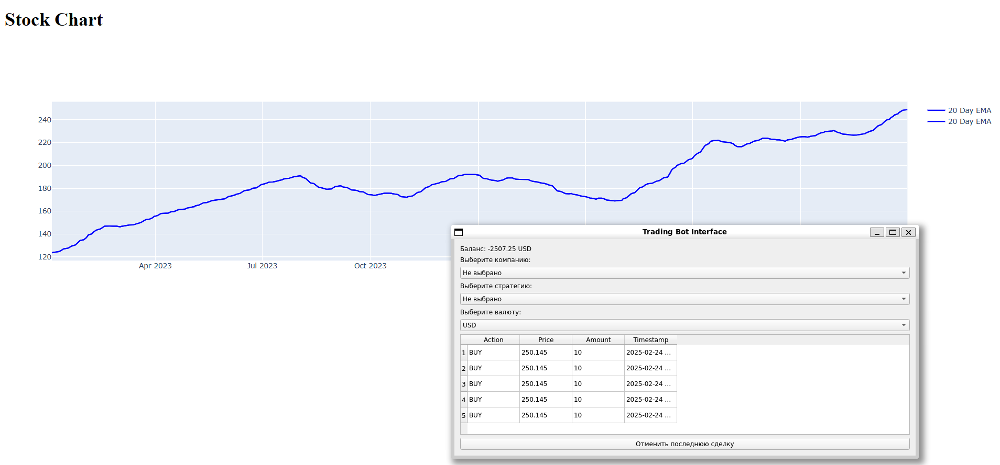

# Курсовая работа по Компьютерным технологиям: Trading Bot

<h1 align="left">
    
</h1>

#### **Тема работы**:  
Разработка приложения для анализа и визуализации данных фондового рынка с использованием Python и C++.

## Заключение
Курсовая работа должна соответствовать следующим требованиям:
1. Используется объектно-ориентированный подход.
2. Реализовано параллельное выполнение кода.
3. Используются STL (C++) и аналогичные библиотеки (Python).
4. Реализован веб-интерфейс (Python) и оконный интерфейс (C++).
5. Используется база данных (MSSQL).

## Навигация
- [1. Использование объектно-ориентированного программирования](#1-использование-объектно-ориентированного-программирования)
  - [Python-часть](#python-часть)
  - [C++-часть](#c-часть)
- [2. Параллельное выполнение кода](#2-параллельное-выполнение-кода)
  - [Python-часть](#python-часть-1)
  - [C++-часть](#c-часть-1)
  - [Синхронизация](#синхронизация)
- [3. Использование STL и аналогичных библиотек](#3-использование-stl-и-аналогичных-библиотек)
  - [Python-часть](#python-часть-2)
  - [C++-часть](#c-часть-2)
- [4. Визуальный интерфейс](#4-визуальный-интерфейс)
  - [Python-часть](#python-часть-3)
  - [C++-часть](#c-часть-3)
- [5. Использование базы данных](#5-использование-базы-данных)


## 1. Использование объектно-ориентированного программирования
В проекте применяется объектно-ориентированный подход программирования.
### **Python-часть**:
В Python-коде используются следующие классы:
1. **`TradeResult`**:
   - Данные о сделке (действие, цена, количество, баланс, временная метка) инкапсулированы внутри класса.
   - Метод `to_dict()` предоставляет интерфейс для преобразования объекта в словарь, скрывая внутреннюю структуру данных.
2. **`StockData`**:
   - Данные о компании (тикер, данные о ценах) инкапсулированы внутри класса.
   - Метод `_load_data()` загружает данные о котировках текущей акции.
3. **`Chart`**:
   - Создаёт веб-интерфейс с использованием библиотеки Dash.
   - Отображает графики данных (EMA, MA).
4. **`SocketServer`**:
   - Данные о подключении к базе данных и сокете инкапсулированы внутри класса.
   - Класс абстрагирует взаимодействие с сокетами и базой данных, предоставляя методы для отправки и получения данных.
   - Реализует сервер для взаимодействия с C++ кодом.
   - Обрабатывает сообщения от клиента (C++) и обновляет параметры.
   - методы connect_to_db() и ensure_db_connection() отвечают за подключение к базе данных, и обновление подключения.
5. **`Strategy`**:
   - Базовый класс для стратегий торговли.
   - `EmaStrategy` наследует базовый класс `Strategy`.
   - Базовый класс Strategy определяет общий интерфейс (метод `execute()` является абстрактным (не реализован)
    - Подкласс `EmaStrategy` реализует этот метод, что позволяет вызывать `execute()` для любого объекта, наследующего Strategy, без знания конкретной реализации.

### **C++-часть**:
В C++ коде используются следующие классы:
1. **`Trade`**:
   - Описывает сделку (компания, действие, цена, количество, временная метка).
   - Методы `addTrade()`, `undoLastTrade()` и `getTrades()` предоставляют интерфейс для работы с историей сделок.
2. **`Wallet`**:
   - Данные о балансе и курсах валют инкапсулированы внутри класса.
   - Методы `updateBalance()` и `getBalance()` предоставляют интерфейс для работы с балансом, скрывая детали реализации.
3. **`TradeHistory`**:
   - Класс абстрагирует работу с историей сделок, предоставляя методы для добавления, отмены и получения сделок.
4. **`TradingBotServer`**:
   - Класс предоставляет интерфейс для взаимодействия с пользователем через графический интерфейс, скрывая детали реализации (например, работу с сокетами и базой данных).
   - Взаимодействует с Python-сервером через сокеты.

---

## 2. Параллельное выполнение кода

### **Python-часть**:
1. **Поток для Dash-сервера**:
   - Запускается в отдельном потоке с помощью `threading.Thread`.
   - Отвечает за отображение графиков веб-интерфейса и их обновление.
2. **Поток для SocketServer**:
   - Обрабатывает входящие соединения от C++ клиента.
   - Использует `threading.Thread` для обработки каждого клиента в отдельном потоке.
3. **Главный поток**:
   - Выполняет стратегию торговли (EMA) и отправляет результаты в C++.

### **C++-часть**:
1. **Главный поток**:
   - Запускает оконный интерфейс (Qt).
2. **Поток для взаимодействия с Python**:
   - Использует `QTcpSocket` для асинхронного обмена данными с Python-сервером.

### **Синхронизация**:
- В Python синхронизация потоков осуществляется через глобальные переменные (например, `current_ticker`, `current_strategy`).
- В C++ синхронизация не требуется, так как взаимодействие с Python происходит через сокеты.

---

## 3. Использование STL и аналогичных библиотек

### **Python-часть**:
1. **`data_cache`**:
   - Используется словарь (`dict`) для кэширования данных о компаниях.
   - Причина: быстрый доступ к данным по ключу (тикеру компании).
2. **`pandas.DataFrame`**:
   - Используется для хранения и обработки данных о ценах акций.
   - Причина: удобство работы с табличными данными и встроенные функции для анализа.

### **C++-часть**:
1. **`std::deque`**:
   - Используется в классе `TradeHistory` для хранения последних сделок.
   - Используется из-за удобства добавления новых сделок, а также удаления последней из-за переплонения или при нажатии кнопки на UI интерфейсе.
2. **`std::unordered_map`**:
   - Используется для хранения истории сделок по компаниям.
    - **Хранение балансов по валютам:**
    В классе `Wallet` определены два словаря (хеш-таблицы):
   - **Хранение истории сделок по компаниям:**
Контейнер используется для организации сделок по названиям компаний.

```c
std::unordered_map<std::string, std::vector<Trade>> tradeMap;
```
3. **`std::vector`**:
   - **Хранение сделок для каждой компании:** В словаре `tradeMap` каждому ключу (названию компании) соответствует объект `std::vector<Trade>`.
   - Используется для обновления таблицы сделок
   - Позволяет динамически расширять таблицу сделок
4. **`std::ofstream`**
    - Записывает сделки в файл
5. **`std::unique_ptr`**
    - В классе `TradingBotServer` используются умные указатели для создания и управления объектами Qt:   
---

## 4. Визуальный интерфейс

### **Python-часть**:
1. **Веб-интерфейс (Dash)**:
   - Используется библиотека Dash для создания интерактивного веб-интерфейса.
   - Компоненты:
     - `dcc.Graph` — для отображения графиков (EMA, MA).
     - `dcc.Interval` — для автоматического обновления графика каждые 10 секунд.

### **C++-часть**:
1. **Оконный интерфейс (Qt)**:
   - Используется библиотека Qt для создания графического интерфейса.
   - Компоненты:
     - `QComboBox` — для выбора компании, стратегии и валюты.
     - `QTableWidget` — для отображения истории сделок.
     - `QLabel` — для отображения текущего баланса.
     - `QPushButton` — для отмены последней сделки.
---

## 5. Использование базы данных

### **Python-часть**:
1. **База данных**:
   - Используется MSSQL для хранения данных о сделках.
   - Подключение к базе данных осуществляется через `pyodbc`.
   - Пример запроса:
     ```sql
     INSERT INTO trade (action, price, amount, timestamp)
     VALUES (?, ?, ?, ?)
     ```
---


---


